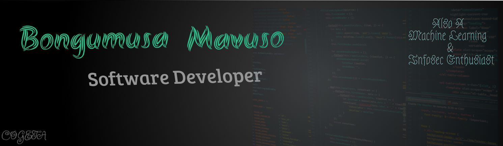

# Hello there! 

My name is Bongumusa Mavuso and I'm a software developer/Data Analyst. I'm from South Africa and currently volunteering at a local NPO. You can find me on [![Twitter][1.2]][1],  or on [![LinkedIn][3.2]][3].

## 🔧 Technologies & Tools

### &#x270d; Machine Learning and Data Analytics Tools
- 
- 
- 
- 
- 
- 

###📓 Now Learning

## 🤸‍♂️ Competitive Programming
I spend my free time participating in competitive programming competitions as a way of keeping up with the tech trends and keeping my skills onpoint!

- Programming Competitions
    - [Topcoder](https://topcoder.com/profile/cogeta)
    - [Codeforces](https://codeforces.com/profile/Cogeta)
- Data Science
    - [Zindi](https://zindi.africa/users/cogeta)
    - [Kaggle](kaggle.com/bongumusa/)

## &#x1f4c8; GitHub Stats

